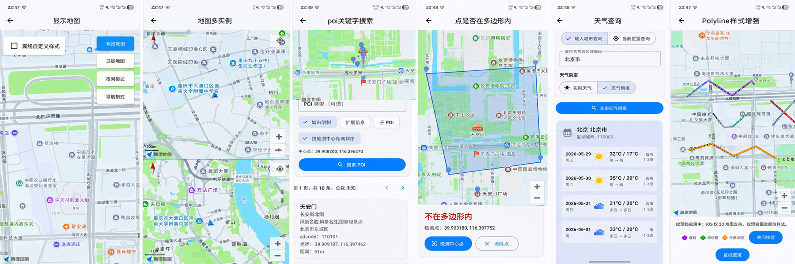
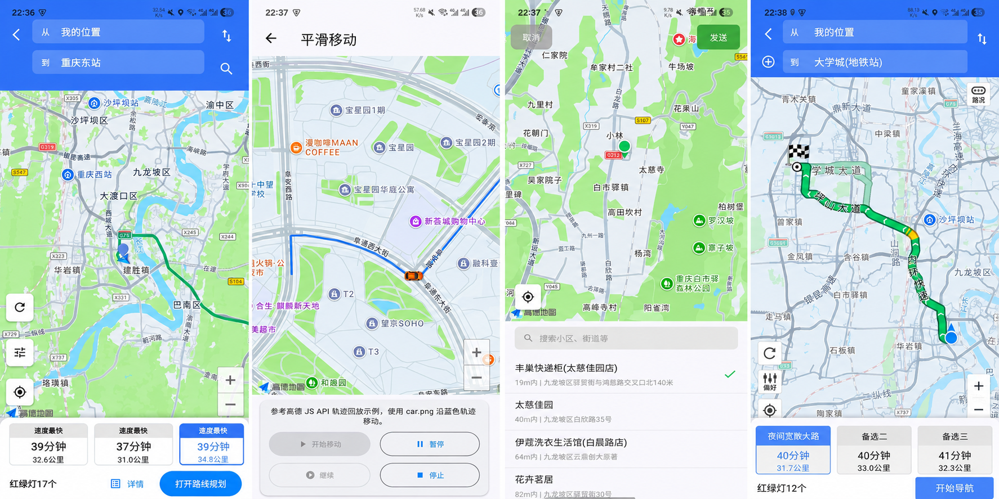

# Flutter 高德地图 / 导航插件工作区

本仓库使用 Dart Pub Workspace 管理两个可独立发布、互不依赖的 Flutter 插件：

| 包 | 版本 | 职责 |
| --- | --- | --- |
| [`flutter_amap`](packages/flutter_amap/README.md) | 2.0.0 | 地图、覆盖物、定位、搜索、天气、路线查询、地点选择 |
| [`flutter_amap_navi`](packages/flutter_amap_navi/README.md) | 1.0.0 | 驾车/步行/骑行导航、路线页、智能巡航、导航事件 |

根目录 [`example`](example/) 同时集成两个插件；每个包的 `example/` 则只依赖自身，用于验证独立集成。

## 功能预览

以下截图展示示例应用的部分功能，点击图片可查看原图。

### 示例入口与功能目录

首页、3D 地图目录与导航目录，方便开发者了解示例功能分布。

[](docs/images/1.png)

### 地图与数据查询

地图样式切换、多地图实例、POI 关键字搜索、点与多边形位置判断、天气查询及折线样式。

[](docs/images/2.png)

### 路线规划与地图交互

路线方案展示、轨迹平滑移动、地点选择及导航路线预览。

[](docs/images/3.png)


## 联合初始化

联合应用必须向两个插件传入相同平台 Key 和同一份真实隐私授权状态：

```dart
await AMapWidget.init(
  apiKey: ApiKey(iosKey: iosKey, androidKey: androidKey),
  agreePrivacy: agreed,
);
await AMapNavi.init(
  config: NaviSdkConfig(
    apiKey: NaviApiKey(iosKey: iosKey, androidKey: androidKey),
    agreePrivacy: agreed,
  ),
);
```

独立使用地图包时，Android 只引入 `3dmap-location-search`，iOS 只引入 `AMap3DMap`、`AMapSearch` 和 `AMapLocation`，不包含导航 SDK。导航包使用已包含 3D 地图的导航合包。

联合应用中，Android 会由导航插件自动将纯地图合包替换为导航合包；iOS 需在 `Podfile` 的 `flutter_ios_podfile_setup` 之前加入：

```ruby
ENV['FLUTTER_AMAP_USE_NAVI_SDK'] = 'true'
```

这样联合工程也只解析一份底层地图实现。

## 从 1.x 迁移

2.0 不提供旧导航 API 转发层。请参阅 [1.x → 2.0 迁移指南](docs/migration-2.0.md)，其中列出了依赖、import、初始化、坐标与策略类型的完整映射。

## 发布标签

- `flutter_amap-v*`：校验并发布 `packages/flutter_amap`
- `flutter_amap_navi-v*`：校验并发布 `packages/flutter_amap_navi`

本次重构不创建标签，也不会实际发布。
