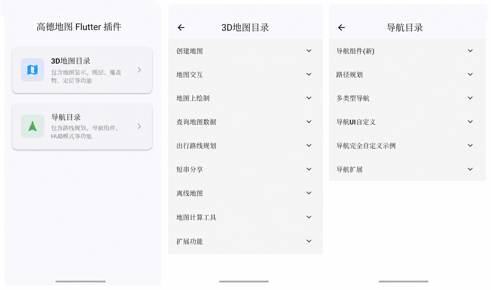

# Flutter 高德地图插件

本项目由 [amap_flutter](https://pub.dev/packages/amap_flutter) 原作者改编而来，目标是在 Flutter 中统一接入高德地图、搜索、定位、路线规划与导航能力，支持 Android、iOS 。



官方文档：

- [Android 地图 SDK](https://developer.amap.com/api/android-sdk/summary/)
- [iOS 地图 SDK](https://developer.amap.com/api/ios-sdk/summary/)
- [Android 导航 SDK](https://developer.amap.com/api/android-navi-sdk/summary/)
- [iOS 导航 SDK](https://developer.amap.com/api/ios-navi-sdk/summary/)


## 当前状态

功能完成度以 `example/lib/features` 示例为准：

- `example/lib/features/map_3d`：地图创建、交互、覆盖物、定位、天气、路线规划等示例。
- `example/lib/features/navigation`：导航组件、地点选择、智能巡航、导航事件和图标收集示例。
- `example/lib/core/utils`：示例 App 通用工具，包含平台判断、Context 扩展和基于 `flutter_easyloading` 的轻提示封装。

## 快速开始

### 初始化 SDK

在 App 启动时先初始化高德 Key 与隐私协议状态：

```dart
await AMapWidget.init(
  apiKey: ApiKey(
    iosKey: '你的 iOS Key',
    androidKey: '你的 Android Key',
  ),
  agreePrivacy: true,
);
```

Android 导航、路线规划等原生页面还建议在宿主 `AndroidManifest.xml` 的 `<application>` 内配置高德 Key：

```xml
<meta-data
    android:name="com.amap.api.v2.apikey"
    android:value="你的 Android Key" />
```

### 创建地图

```dart
AMapWidget(
  mapOptions: AMapMapOptions(
    initCameraPosition: CameraPosition(
      position: Position(latitude: 39.984120, longitude: 116.307484),
      zoom: 16,
    ),
    showTraffic: true,
  ),
  gestureOptions: const AMapGestureOptions(
    dragEnable: true,
    zoomEnable: true,
  ),
  uiOptions: const AMapUiOptions(
    compassControlEnabled: true,
    scaleControlEnabled: true,
  ),
  onMapCreated: (controller) async {
    await controller.waitForMapCompleted();
  },
)
```

`AMapWidget` 仍兼容旧的平铺参数；新代码推荐优先使用分组 options，避免 Android、iOS 参数混在同一层。

## AMapWidget API 分层

- 核心地图配置：`AMapMapOptions`，包含地图类型、初始视野、缩放范围、交通图层、室内图、卫星图、路网图、自定义离线样式等。
- 手势配置：`AMapGestureOptions`，包含拖拽、缩放、俯仰、旋转。
- 控件配置：`AMapUiOptions`，包含指南针、比例尺、缩放控件、Logo 和控件位置。
- 定位配置：`AMapLocationOptions`，包含定位蓝点、定位按钮和定位样式。
- SDK 初始化配置：`AMapSdkConfig`，用于集中传入 `ApiKey`、隐私同意状态和导航图标预加载开关。

## 功能清单

以下严格按 `example/lib/features/map_3d/index.dart` 与 `example/lib/features/navigation/index.dart` 中的示例菜单整理，勾选状态对应菜单项的 `isCompleted`。

### 3D 地图

#### 创建地图

- [x] 显示地图
- [x] 地图ListView
- [ ] 地图Recycle
- [ ] 显示地图(6种实现地图的方式)
- [ ] ViewPager TextureMapView
- [x] 地图多实例
- [ ] 室内地图功能
- [ ] AMapOptions实现地图

#### 地图交互

- [x] UI Settings功能
- [x] 地图Logo位置
- [ ] Layers图层功能
- [x] 手势交互
- [x] Events功能
- [x] 地图Poi点击功能
- [x] 改变地图中心点
- [x] 地图动画效果
- [x] 自定义缩放
- [x] 地图截屏功能
- [x] 限制缩放级别功能
- [x] 限制显示区域功能

#### 地图上绘制

- [x] Markers功能
- [x] Marker点击回调
- [x] Marker动画功能
- [x] InfoWindow功能
- [x] 自定义Marker
- [x] Location几种模式
- [x] Location小蓝点自定义功能
- [x] Location小蓝点自定义模式
- [x] Polylines功能
- [x] 绘制多彩线
- [x] 绘制大地曲线
- [x] 绘制弧线
- [x] NavigateArrow功能
- [ ] Polygons功能
- [ ] 热力图功能
- [ ] GroundOverlay功能
- [ ] Opengl接口功能
- [ ] 自定义建筑物
- [ ] 海量点功能
- [ ] 绘制空心多边形功能
- [ ] 显示单个省份地图
- [ ] 粒子效果
- [ ] 粒子效果+天气示例
- [ ] 蜂窝热力图

#### 查询地图数据

- [x] poi关键字搜索
- [x] poi周边搜索
- [ ] poilD搜索功能
- [ ] 沿途搜索
- [ ] 输入提示
- [ ] POI父子关系
- [x] 天气查询
- [x] 地理编码功能
- [x] 逆地理编码功能
- [ ] 行政区划查询
- [ ] 行政区划边界查询
- [ ] Busline公交查询
- [ ] 公交站点查询
- [ ] 云图检素

#### 出行路线规划

- [x] 驾车路径规划
- [ ] 驾车未来路径规划
- [x] 步行路径规划
- [ ] 公交路径规划
- [x] 骑行路径规划
- [ ] 货车路径规划
- [x] 距离测量
- [ ] Route路径规划

#### 短串分享

- [ ] 短串分享

#### 离线地图

- [x] 离线地图功能(已过时)
- [ ] 离线地图功能(组件包含UI)

#### 地图计算工具

- [x] 坐标系转换
- [ ] 经纬度转屏幕像素
- [x] 两点间距离
- [ ] 点是否在多边形内

#### 扩展功能

- [ ] 轨迹纠偏功能
- [ ] 轨迹纠偏功能_便捷版
- [ ] 平滑移动

### 导航

#### 导航组件(新)

- [ ] 起终点算路
- [ ] 无起点算路
- [ ] 途经点算路
- [x] 组件直接导航
- [ ] 自定义 Activity 的导航组件（Android 原生容器）
- [x] 选取地点 (POI)（示例）

#### 路径规划

- [ ] 驾车路径规划
- [ ] 步行路径规划
- [ ] 骑行路径规划
- [ ] 货车导航路径规划
- [ ] 独立路径规划

#### 多类型导航

- [ ] 内置语音导航
- [ ] 实时导航
- [ ] 模拟导航
- [ ] 货车导航
- [x] 智能巡航
- [ ] HUD导航

#### 导航UI自定义

- [ ] 自定义车标
- [ ] 自定义路线UI
- [ ] 自定义路线纹理
- [ ] 自定义路口转向提示
- [ ] 正北模式
- [ ] 自定义全览模式
- [ ] 自定义指南针
- [ ] 自定义路况按钮
- [ ] 自定义放大缩小按钮
- [ ] 自定义路口放大图
- [ ] 自定义导航光柱(new)
- [ ] 自定义车道信息

#### 导航完全自定义示例

- [ ] 自车改变位置和绘制路线示例
- [ ] 路名、剩余距离、转向图标示例
- [ ] 绘制导航路况条示例
- [ ] 自定义车道信息示例
- [ ] 路口放大图示例
- [ ] 摄像头违章提醒示例
- [ ] 各组件整合导航示例

#### 导航扩展

- [ ] 传入GPS数据导航
- [ ] 展示导航路径详情
- [ ] 主辅路切换
- [ ] 科大讯飞语音集成

## 示例工程

示例工程入口：`example/lib/main.dart`。

目录结构：

```text
example/lib
├── core
│   └── utils
│       ├── context_ext.dart
│       ├── loading_util.dart
│       ├── platform_util.dart
│       └── utils.dart
├── features
│   ├── map_3d
│   │   ├── create_map
│   │   ├── map_interaction
│   │   ├── map_overlay
│   │   ├── map_query
│   │   └── route_planning
│   └── navigation
└── main.dart
```

示例 App 使用 `flutter_easyloading` 统一替代页面中的 `ScaffoldMessenger` 轻提示：

```dart
CupertinoApp(
  builder: LoadingUtil.init(),
  home: const FeatureListPage(),
)
```

## 平台能力矩阵

| 能力 | Android | iOS | 说明 |
| --- | --- | --- | --- |
| 创建地图、多地图实例 | 支持 | 支持 |  |
| 相机移动、缩放、限制区域 | 支持 | 支持 | `moveCamera` 默认等待地图加载完成 |
| 地图交互事件 | 支持 | 支持 |  |
| Marker 声明式集合 | 支持 | 支持 | `markers` 按 `id` 做增删/替换 |
| Marker 动画 | 支持 | 支持 | Android 使用原生 Marker 动画，iOS 使用 UIView 动画 |
| InfoWindow / callout | 支持 | 支持 | 依赖 Marker 的 `title` / `snippet` |
| Polyline/Arc/Polygon | 支持 | 支持 | `polylines`、`arcs`、`polygons` 按 `id` 做增删/替换 |
| 定位蓝点 | 支持 | 支持 | 需业务侧先申请运行时定位权限 |
| 自定义离线样式 | 支持 | 支持 | 启用时会切回标准底图 |
| 搜索、POI、天气 | 支持 | 支持 | 以 example 与原生 SDK 能力为准 |
| 导航组件 | 支持 | 支持 |  |
| 智能巡航 | 支持 | 支持 | 与正式导航互斥，需联网和真实驾车场景验证 |

## 回归检查清单

- 双地图和 ListView 地图页面：确认创建、销毁、滚动回收后无残留事件回调。
- 相机操作页面：确认地图加载完成前后调用 `moveCamera` 都能生效。
- Marker 页面：确认声明式 `markers` 与 Controller `addMarker/removeMarker` 不互相破坏。
- Marker 动画页面：确认播放、取消和 UnsupportedError 提示正常。
- InfoWindow 页面：确认 `title` / `snippet`、显示和隐藏逻辑正常。
- Polyline/Arc/Polygon 页面：确认 Android/iOS 能正确绘制、更新和移除覆盖物。
- 定位页面：确认 `showUserLocation`、`userLocationStyle`、`onUserLocationChange`、`waitForUserLocation` 仍正常。
- 自定义样式页面：确认启用/关闭样式后底图类型和缩放范围正常。
- 搜索与地点选择页面：确认输入提示、周边搜索、地点选择器和天气查询正常。
- 导航页面：确认启动/停止导航、事件订阅、转向图标、智能巡航互斥逻辑正常。
